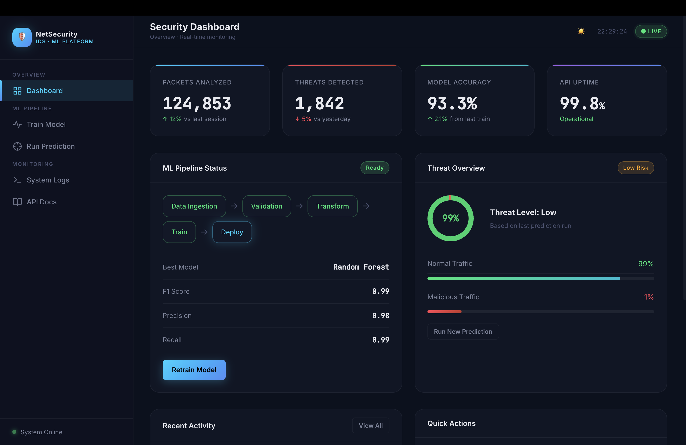
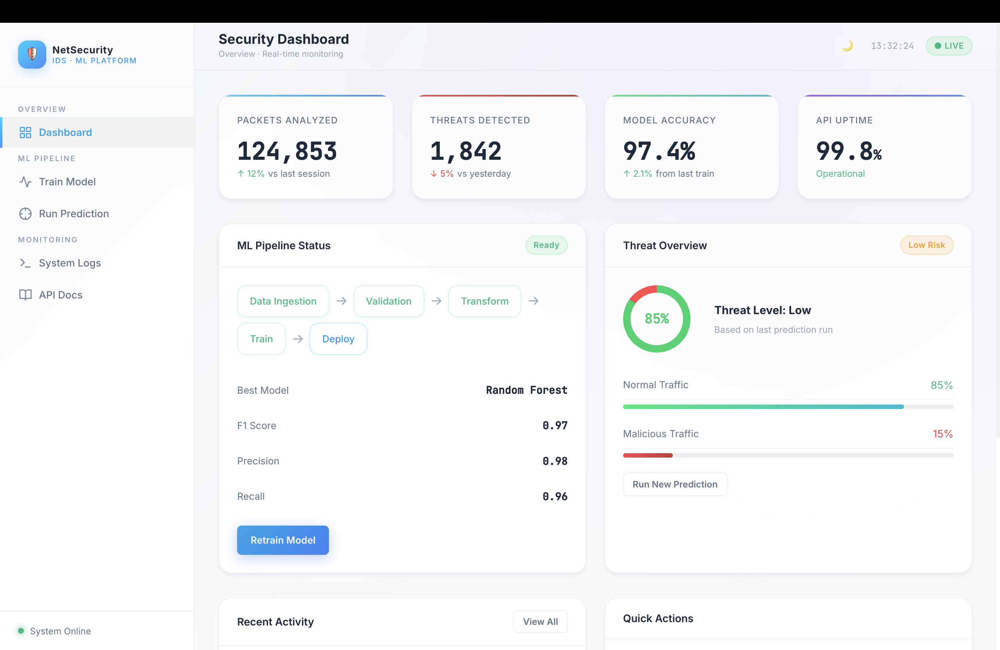

<div align="center">
  <h1>🛡️ Network Security Threat Detection System</h1>
  <p><i>A production-ready Machine Learning and DevOps platform for real-time phishing and network threat detection.</i></p>
  
  [](https://www.python.org)
  [](https://fastapi.tiangolo.com)
  [](https://www.docker.com/)
  [](https://github.com/alwaysprince05/networksecurity/actions)
  
  <br />

  [](http://13.233.60.175:8080/)
  [](http://13.233.60.175:8080/docs)

  <br />
</div>

<div align="center">
  
  <br>
  
</div>

---

## 📑 Table of Contents
- [✨ Key Features](#-key-features)
- [🛠️ Tech Stack](#️-tech-stack)
- [🌐 Live Demonstration](#-live-demonstration)
- [📡 API & UI Endpoints](#-api--ui-endpoints)
- [💻 Local Development Setup](#-local-development-setup)
- [🚀 Operations & AWS DevOps](#-operations--aws-devops)
- [📂 Project Structure](#-project-structure)

---

## ✨ Key Features
- **End-to-End ML Pipeline:** Fully decoupled architecture handling data ingestion, validation, transformation, and model training.
- **Premium Dark-Themed UI:** A sleek, fully responsive dashboard built with vanilla HTML/CSS and Jinja2, featuring Chart.js analytics and particles.js.
- **High-Performance Backend:** Powered by FastAPI for lightning-fast asynchronous predictions.
- **Interactive Data Analysis:** Upload massive network traffic CSV logs and get instantaneous threat categorizations using DataTables.js.
- **Continuous Deployment:** Seamless, automated deployments to AWS EC2 using GitHub Actions and ECR.

---

## 🛠️ Tech Stack
- **Languages:** Python, JavaScript
- **Backend:** FastAPI, Uvicorn
- **Machine Learning:** Scikit-learn (Random Forest Classification)
- **Database:** MongoDB (NoSQL)
- **Frontend:** HTML5, CSS3, Jinja2, Chart.js, DataTables
- **DevOps:** Docker, GitHub Actions, AWS ECR, AWS EC2

---

## 🌐 Live Demonstration
Experience the fully functional deployment using the live links below:
> 🔗 **[Click here to view the Live UI Dashboard](http://13.233.60.175:8080/)**  
> 🔗 **[Click here to explore the Swagger API Documentation](http://13.233.60.175:8080/docs)**

---

## 📡 API & UI Endpoints

The system is highly modular, offering both a beautiful visual interface and raw programmatic API endpoints.

**User Interfaces (UI):**
- `GET /` — The main graphical dashboard / statistics overivew.
- `GET /train-ui` — Interface for safely triggering and monitoring the ML training pipeline.
- `GET /predict-ui` — Drag-and-drop prediction engine.
- `GET /logs-ui` — Live remote viewer for server logs.

**Raw Backend APIs:**
- `GET /train` — Silently triggers the ML Data Pipeline (Ingestion → Validation → Transformation → Training).
- `POST /predict` — Accepts a `.csv` payload and returns evaluated ML labels.
- `GET /api/status` — Health-check ping.

---

## 💻 Local Development Setup

### 1. Clone the repository
```bash
git clone https://github.com/alwaysprince05/networksecurity.git
cd networksecurity
```

### 2. Initialize the Python environment
```bash
python3 -m venv venv
source venv/bin/activate
pip install -r requirements.txt
```

### 3. Configure Secrets
Create a `.env` file at the root. You must provide a valid MongoDB connection string.
```env
MONGODB_URL_KEY="mongodb+srv://<user>:<password>@cluster/..."
```

### 4. Boot the server
```bash
python app.py
```
Open up your browser to `http://127.0.0.1:8000/` and you'll immediately see the frontend interface.

---

## 🚀 Operations & AWS DevOps

### Docker Containerization
The application is aggressively optimized using a thin Debian Linux image and a strict `.dockerignore` file. This prevents arbitrary database collisions with local `mlflow` trackers.
```bash
docker build -t networksecurity .
docker run -d --name networksecurity -p 8080:8000 networksecurity
```

### CI/CD Pipeline (AWS EC2 + ECR)
The application utilizes an automated **GitHub Actions** architecture (`main.yml`) that instantly initiates upon a push to the `main` branch. 
1. The code is compressed and vetted.
2. The `Dockerfile` compiles within an isolated GitHub Runner and patches to **AWS ECR**.
3. It securely SSH's into our **AWS EC2** instance, destroys the old running container, and spins up the newest codebase.

*(Requires `MONGODB_URL_KEY`, `AWS_ACCESS_KEY_ID`, `AWS_ECR_LOGIN_URI`, and `EC2_SSH_KEY` in the repository secrets).*

---

<details>
<summary>📂 <strong>Click to expand Project Structure</strong></summary>

```text
networksecurity/
├── .github/workflows/          # CI/CD workflows for AWS Automation
├── networksecurity/            # Core computational engine
│   ├── components/             # Ingestion, Validation, Transformation, Training
│   ├── pipeline/               # Full pipeline orchestrators
│   ├── model/                  # Custom Scikit-Learn estimators
│   ├── cloud/                  # AWS S3 sync adapters
│   └── exception/              # Customized traceback handlers
├── static/                     # CSS stylesheets, JS frontend controllers
├── templates/                  # Jinja2 HTML views (Dashboards, Predict, Logs)
├── final_model/                # Pickled production ML models (.pkl)
├── logs/                       # System events and exception history
├── prediction_output/          # Auto-generated CSV files of predictions
├── app.py                      # FastAPI core entry point
└── Dockerfile                  # Slim Python 3.10 deployment schema
```

</details>

---

<div align="center">
  <p><b>Author:</b> Prince Kumar Maurya</p>
</div>
