# 🛡️ Network Security – Intrusion Detection ML System  
## 📊 System Design Architecture

This section presents the **system design and architecture** of the Intrusion Detection Machine Learning System.

The diagrams below illustrate how data flows through the system — from **network traffic ingestion** to **threat detection, processing, and response**.

---

## 🔹 🧩 High-Level Architecture

### 📌 Figure 1 – Overall System Overview
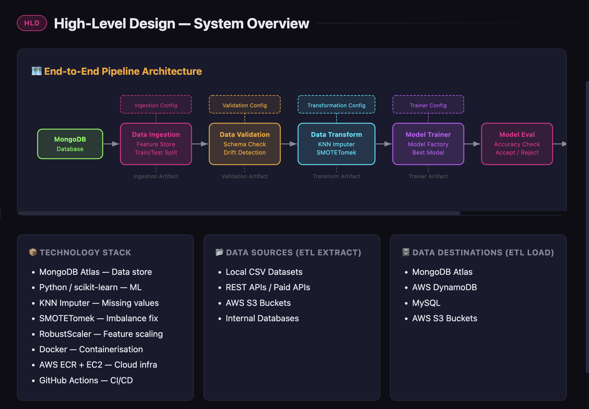

---

## 🔹 📡 Data Flow & Pipeline

### 📌 Figure 2 – Data Ingestion Pipeline
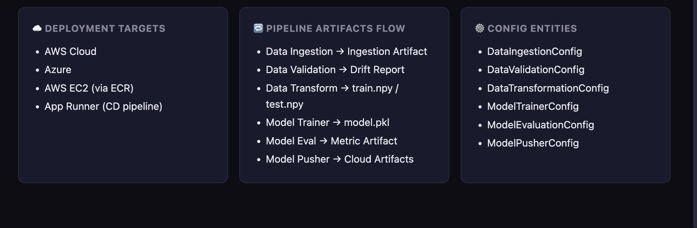

### 📌 Figure 3 – Data Preprocessing & Feature Engineering
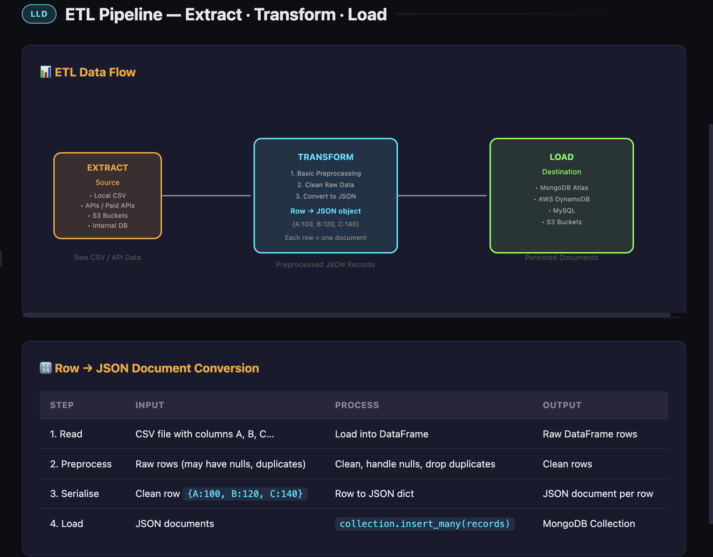

---

## 🔹 🤖 Machine Learning Workflow

### 📌 Figure 4 – Model Training Pipeline
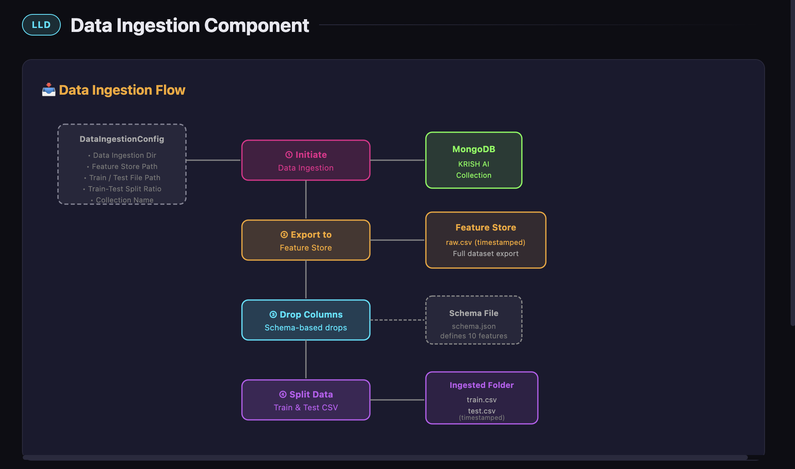

### 📌 Figure 5 – Model Evaluation & Validation
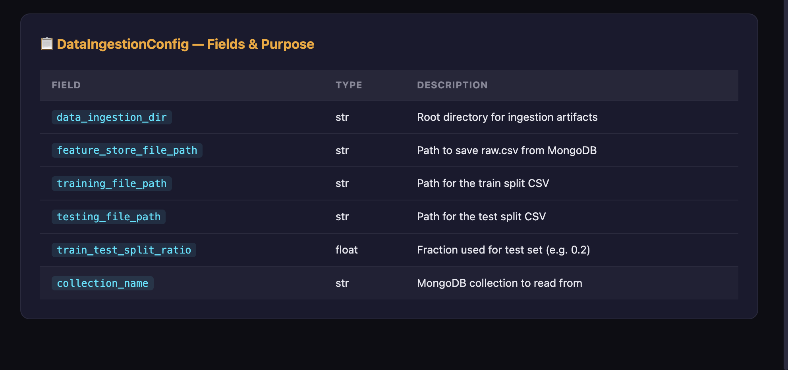

---

## 🔹 ⚙️ Backend & API Layer

### 📌 Figure 6 – FastAPI Backend Architecture
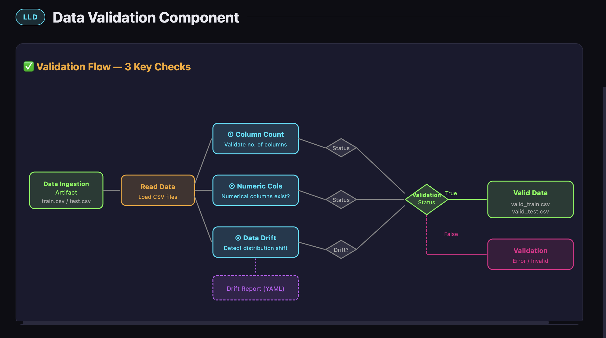

### 📌 Figure 7 – API Request/Response Flow
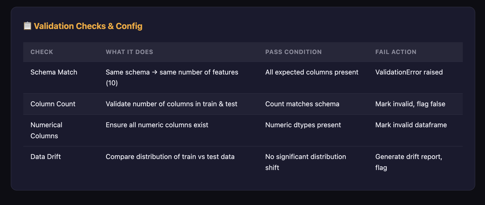

---

## 🔹 🚀 Deployment & DevOps

### 📌 Figure 8 – Docker Containerization
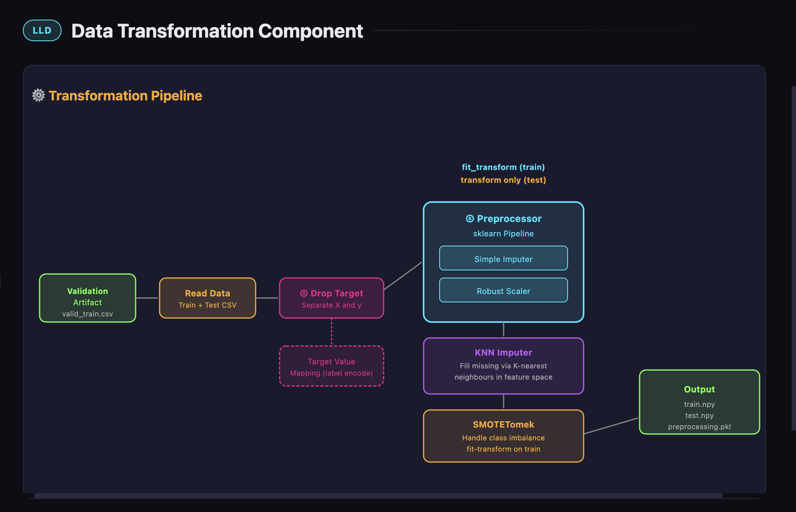

### 📌 Figure 9 – CI/CD Pipeline (GitHub Actions)
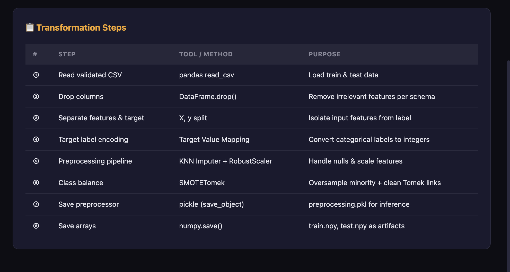

### 📌 Figure 10 – AWS Deployment (ECR / EC2)
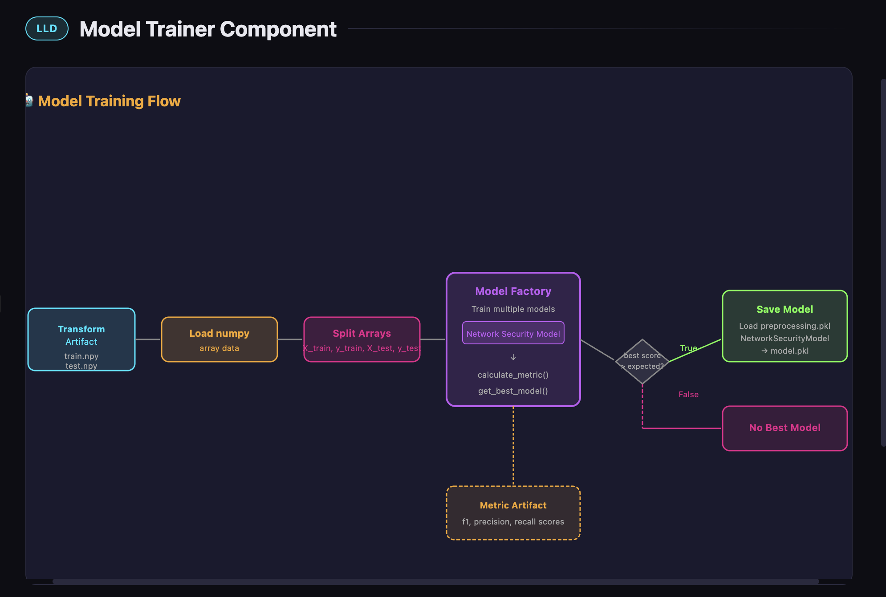

---

## 🔹 🔐 Security & Monitoring

### 📌 Figure 11 – Intrusion Detection Flow
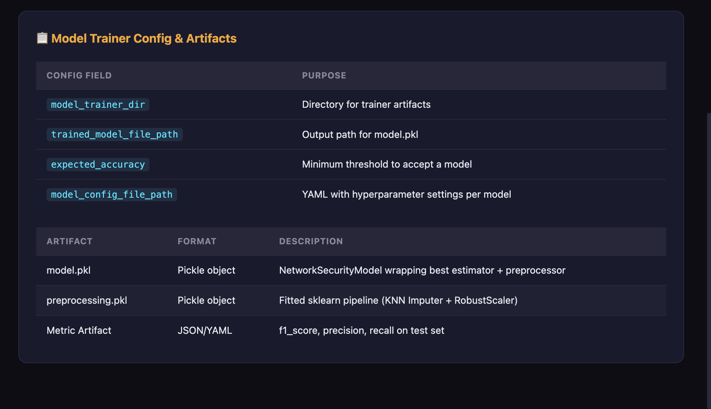

### 📌 Figure 12 – Alerting & Logging System
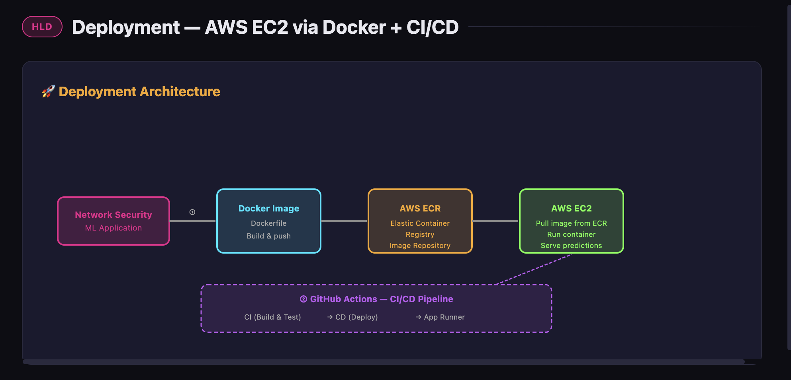

---

## 🔹 📈 System Scalability

### 📌 Figure 13 – Scalable Architecture Design
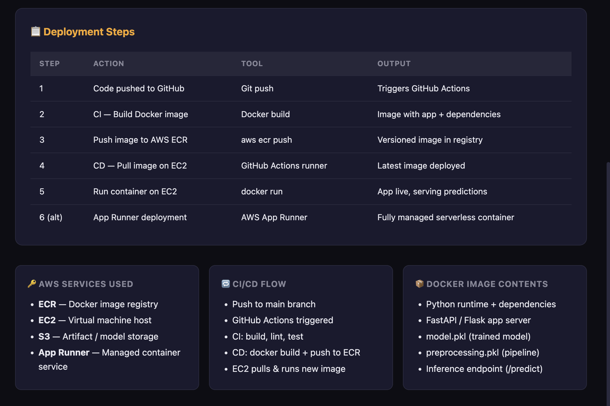

---

# 🚀 Key Highlights

- 🔍 Real-time intrusion detection using ML models  
- ⚡ FastAPI-based high-performance backend  
- 🐳 Dockerized deployment for portability  
- 🔄 Automated CI/CD pipeline using GitHub Actions  
- ☁️ Cloud deployment on AWS (ECR, EC2)  
- 📊 Scalable and modular architecture  
- 🔐 Built-in logging, monitoring, and alerting  

---

# 📌 Summary

This system is designed to be:
- **Scalable** → Handles increasing traffic  
- **Reliable** → Fault-tolerant architecture  
- **Secure** → Detects and mitigates threats  
- **Production-ready** → End-to-end ML + DevOps pipeline  

---