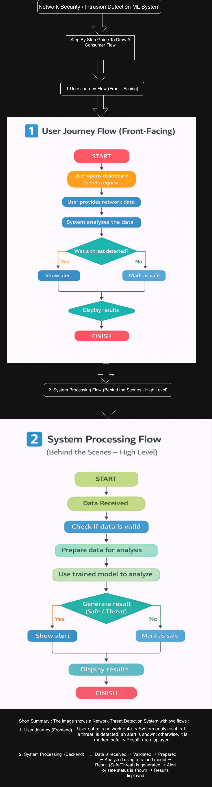

# 🚀 Network Security – Intrusion Detection ML System  
## 📊 User Flow Diagram

This document provides a clear overview of the **user interaction flow** within the Intrusion Detection Machine Learning System.

It illustrates how users:
- Upload network traffic data  
- Trigger intrusion detection  
- Analyze and interpret results  

---

## 🧭 Overview

The system is designed to deliver a **seamless and efficient workflow** for detecting potential network threats using Machine Learning.

From data input to actionable insights, each step ensures:
- Accuracy  
- Speed  
- Security  

---

## 🔄 User Flow Diagram

---

## ⚙️ Step-by-Step Workflow

### 1️⃣ Data Upload
- Users upload network traffic data (e.g., CSV, JSON)
- System validates:
  - File format  
  - Data integrity  
  - Required schema  

---

### 2️⃣ Data Preprocessing
- Handles missing or inconsistent values  
- Performs feature encoding and transformation  
- Normalizes data for model compatibility  

---

### 3️⃣ Intrusion Detection (ML Model)
- Processed data is passed to the trained ML model  
- The model classifies traffic into:
  - ✅ Normal  
  - ⚠️ Suspicious  
  - 🚨 Malicious  

---

### 4️⃣ Result Generation
- System generates:
  - Prediction results  
  - Confidence scores  
  - Attack type (if detected)  

---

### 5️⃣ Visualization & Insights
- Results are displayed via an interactive dashboard:
  - Traffic distribution  
  - Threat levels  
  - Trends and patterns  

---

### 6️⃣ User Actions
- Download analysis reports  
- Re-run predictions  
- Store results for future reference  

---

## ✨ Key Features

- ⚡ Real-time intrusion detection  
- 📊 Insightful data visualization  
- 🔐 Secure data processing  
- 🤖 Scalable ML pipeline  

---

## 🎯 Conclusion

This user flow ensures a **smooth and intuitive experience**, enabling users to:
- Quickly detect threats  
- Understand network behavior  
- Take informed security actions  
