# 🖥️ Network Security System – Wireframes & Screenshots

This document showcases the key wireframes and screenshots of the **Intrusion Detection & Network Security System UI** alongside deployment configurations.
Each screen is described to provide clarity on its purpose and features.

---

## ☁️ AWS Elastic Container Registry (ECR)

**Purpose:**  
Demonstrates the successful push of the Docker image to AWS ECR.

**Features:**
- Repository visibility (`networkssecurity`)
- Image tag (`latest`)
- Artifact size and push timestamp

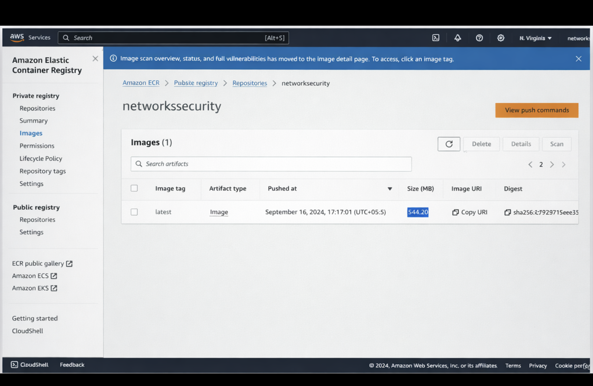

---

## 💻 AWS EC2 Instances

**Purpose:**  
Shows the active EC2 instance running the deployed Network Security application.

**Features:**
- Instance ID and state (Running)
- IPv4 address details
- Status checks and instance type (`t2.large`)

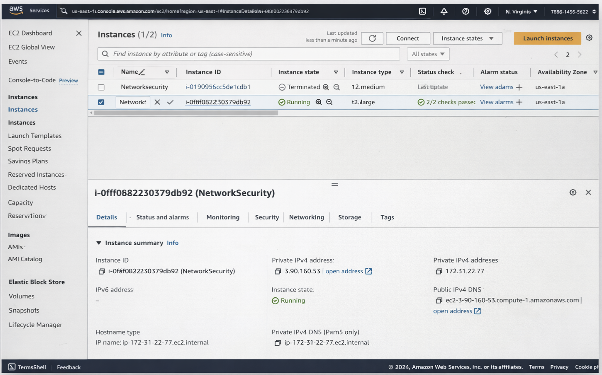

---

## 🔌 FastAPI Swagger UI — Routes

**Purpose:**  
Overview of the available API endpoints provided by the FastAPI backend.

**Features:**
- UI routes (`/train-ui`, `/predict-ui`, etc.)
- API routes (`/train`, `/predict`)
- Interactive documentation interface

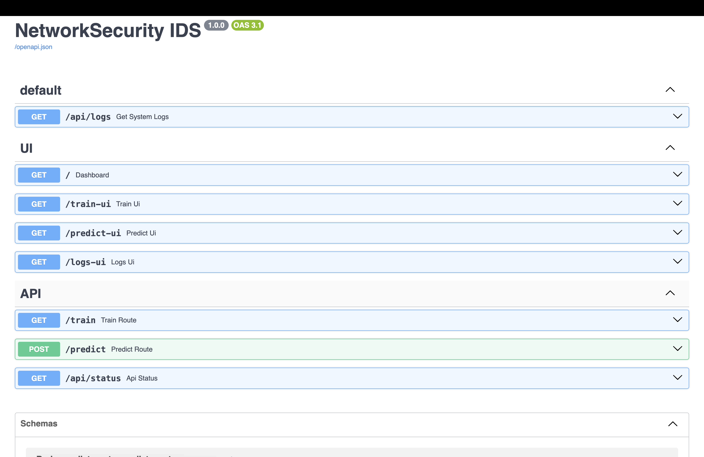

---

## 📡 FastAPI — Predict Route Details

**Purpose:**  
Detailed view of the `POST /predict` API endpoint.

**Features:**
- Request body requirements
- `multipart/form-data` format
- Required `file` parameter for CSV upload

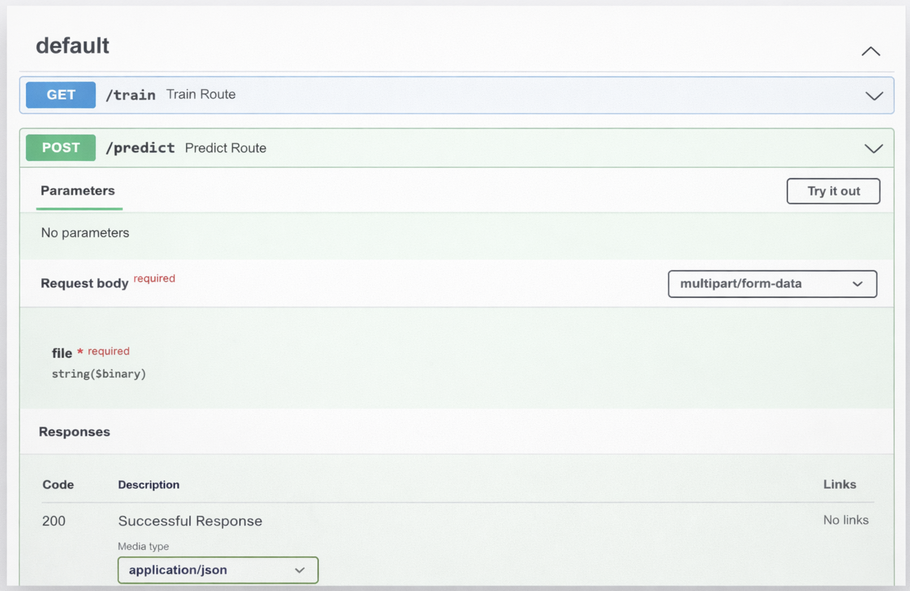

---

## 📤 FastAPI — Prediction Execution

**Purpose:**  
Testing the `POST /predict` endpoint directly through the Swagger UI.

**Features:**
- File selection interface (`test.csv` uploaded)
- Execution trigger button
- Parameter configuration

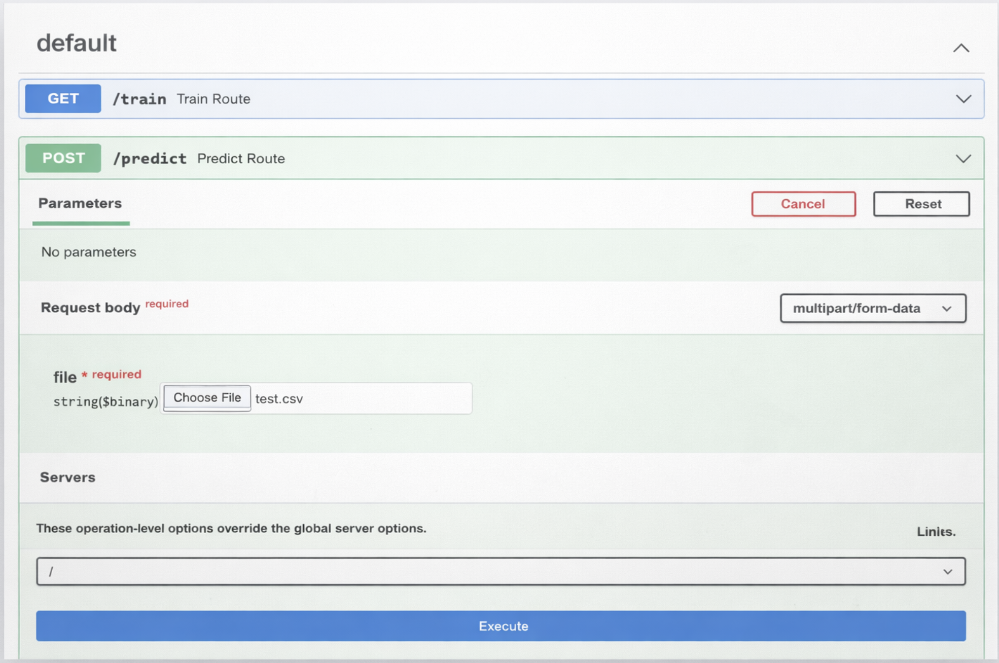

---

## 📄 FastAPI — Prediction Response Body

**Purpose:**  
Displays the executed curl command and the resulting HTML response body.

**Features:**
- Auto-generated curl command for the request
- HTML response rendering a data table with prediction results
- `200` status code

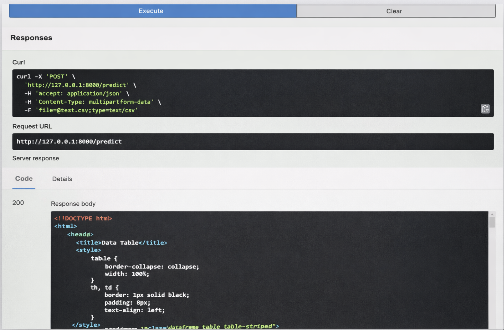

---

## 🛠️ FastAPI — Prediction Response Headers

**Purpose:**  
Shows the server and header details of a successful prediction request.

**Features:**
- `content-type: text/html`
- Server identifier (`uvicorn`)
- Access control headers

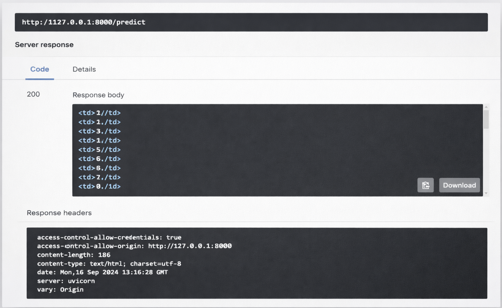

---

## 📊 Dashboard — Dark Theme

**Purpose:**  
The main Network Security dashboard providing high-level metrics in a dark aesthetic.

**Features:**
- Analyzed packets and threat tallies
- Model accuracy and API uptime metrics
- ML Pipeline status overview
- Threat Level visualizer

---

## 📊 Dashboard — Light Theme

**Purpose:**  
The main Network Security dashboard presented in a lighter, high-contrast aesthetic.

**Features:**
- Identical metrics to the dark theme
- Clean, bright UI layout
- Threat Level visualizer

---

## 🤖 Train Model — Configuration 

**Purpose:**  
Interface to configure and initiate the Machine Learning training pipeline.

**Features:**
- Data source configuration (MongoDB)
- Target column and model evaluation settings
- Pipeline progress tracker (Idle state)

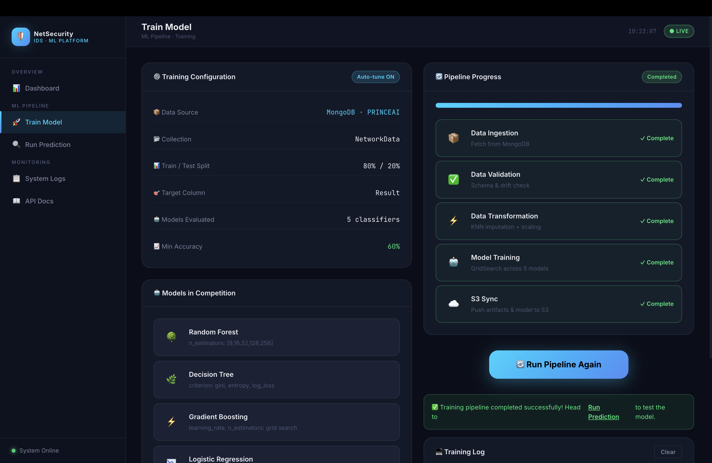

---

## ✅ Train Model — Completion

**Purpose:**  
Shows the successful execution of the model training pipeline.

**Features:**
- Complete markings for Ingestion, Validation, Transformation, Training, and S3 Sync
- Success notification alert
- Option to "Run Pipeline Again"

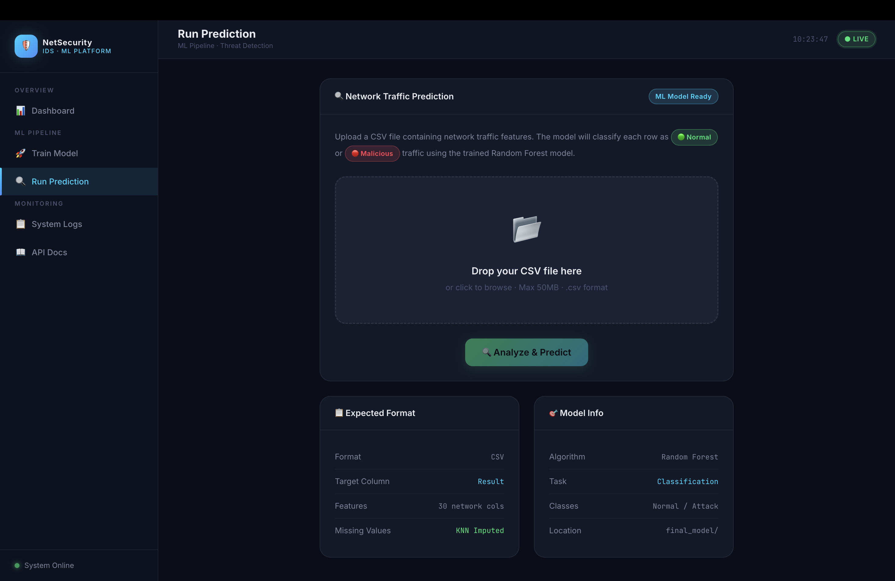

---

## 🔮 Run Prediction — Upload Interface

**Purpose:**  
Dedicated UI for uploading network traffic data for threat classification.

**Features:**
- Drag-and-drop CSV file upload area
- Expected format guidelines (30 network cols)
- Model information display (Random Forest)

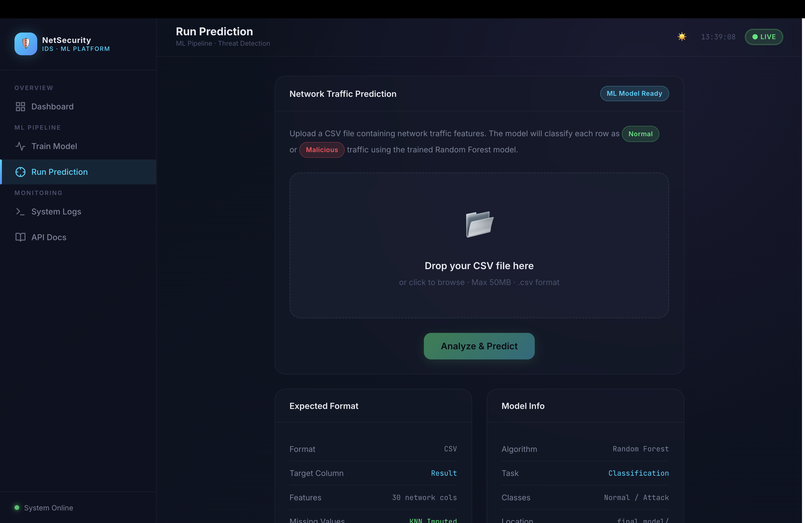

---

## 📋 Run Prediction — Results

**Purpose:**  
Displays the output classification of the uploaded network traffic data.

**Features:**
- Total records processed tally
- Tabular viewer of the uploaded features mapped to their predictions
- Scrollable data table

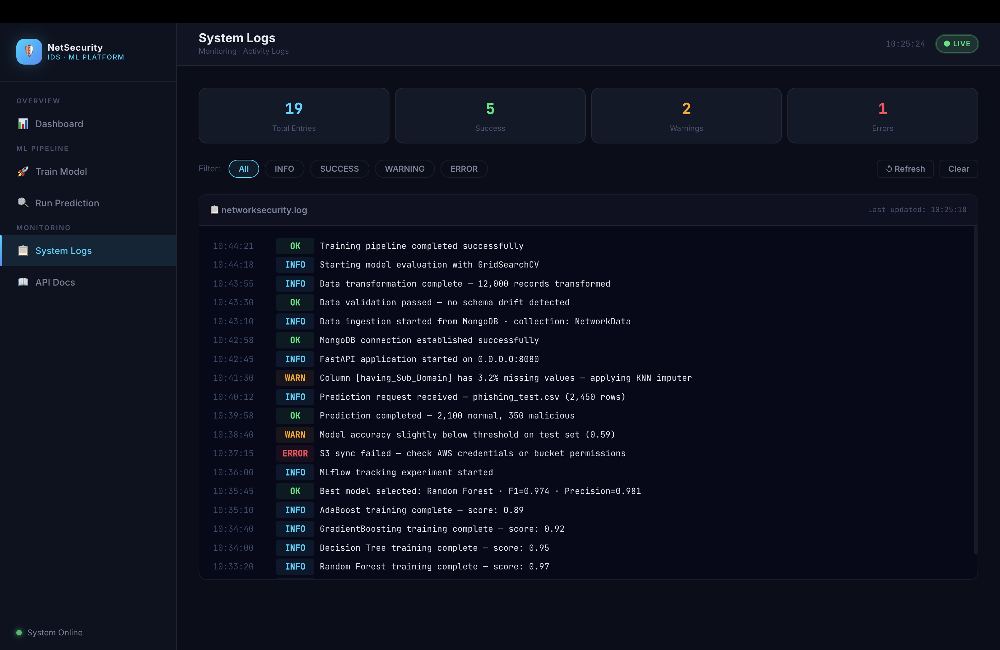

---

## 📜 System Logs

**Purpose:**  
Real-time monitoring of backend system activity and model tracking.

**Features:**
- Categorized entry totals (Success, Warnings, Errors)
- Log filtering options
- Timestamped terminal output (e.g., Data Ingestion, Model trainer artifact initialization)

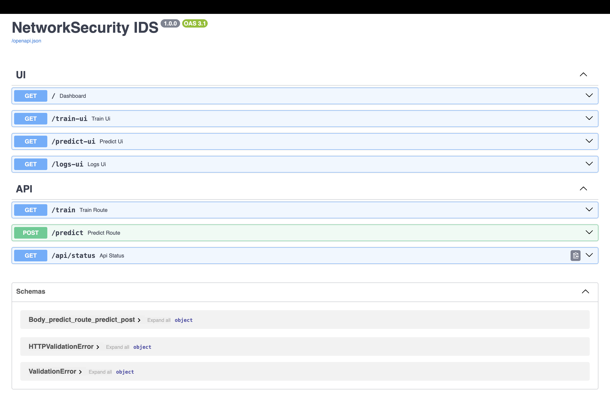

---

## ✨ Design Goals

- Clarity and simplicity  
- Security-focused UI  
- Data-driven insights  
- Easy navigation  